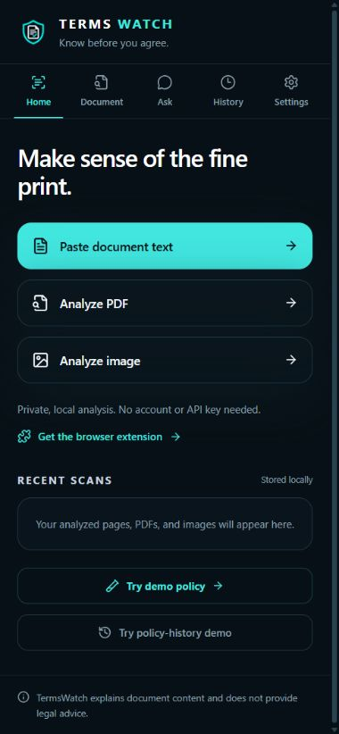
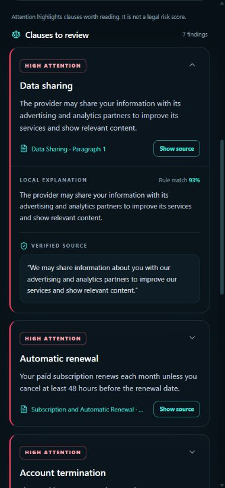
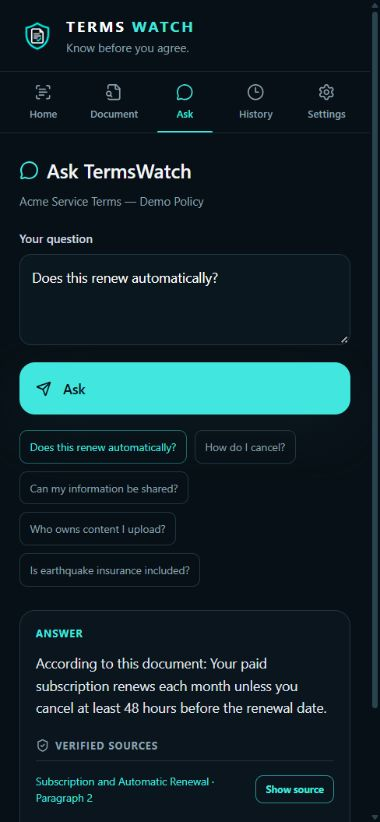

# TermsWatch

**Know before you agree.** TermsWatch helps you read long terms, policies and agreements without losing sight of the original words. It highlights clauses worth checking, gives short document-specific explanations, answers questions from retrieved evidence, and lets you open the cited source.

🌐 **[Try the website](https://eonash2722.github.io/TermsWatch/)** · [Demo policy](https://eonash2722.github.io/TermsWatch/demo/policy.html) · [Submission checklist](docs/SUBMISSION.md)

<p align="center">
  
  
  
</p>

The screenshots use TermsWatch's fictional Acme policy. No private document is included in this repository.

## Why this exists

Fine print is hard to compare and easy to misread. A plausible summary is not enough if you cannot check it. TermsWatch keeps every finding tied to a source block and an exact quotation. The explanation can use simpler wording; the citation must match the extracted document text verbatim.

## What you can do

- **Website:** paste text or open a PDF or image. Analyze and Ask work locally without an account.
- **Browser extension:** scan the active webpage on demand and jump back to a matching passage. It does not monitor tabs continuously.
- **Android app:** import PDFs and images, capture paper pages, or receive shared files, text and URLs.
- **Review:** see a short fact-based summary, attention-labelled findings, original-source highlights and a saved local history.
- **Compare:** rescan a page or try the built-in old/new policy demo to see changed clauses.
- **Ask:** get a grounded answer from local retrieval. Common legal synonyms such as *banned* and *suspended* are connected; questions with no supporting evidence are refused.

Attention labels and rule-match strength are reading aids, **not** legal risk scores or legal advice.

## Try it in one minute

1. Open the [website](https://eonash2722.github.io/TermsWatch/) and select **Try demo policy**. No download or sign-in is needed.
2. Open a finding's **Show source** link to inspect the exact passage.
3. Select **Ask this document** and ask “Does this renew automatically?” The answer should mention the 48-hour deadline and show its source.
4. Ask “Is earthquake insurance included?” to see how TermsWatch handles missing evidence.

For file imports, use the fictional PDFs and images in [`fixtures/`](fixtures/). The public [demo webpage](https://eonash2722.github.io/TermsWatch/demo/policy.html) is useful when testing the extension.

## Run from source

Requires Node.js 22+ and npm. The release build uses Node.js 24.

```sh
npm ci
npm test
npm run typecheck
npm run lint
npm run build:web
npm run preview:web
```

Open `http://127.0.0.1:4188/`. `dist-web/` is the deployable static website; `dist/` is the unpacked Chrome/Edge extension. `release/` receives the website and extension ZIPs. GitHub Pages builds `dist-web/` automatically from `main` using [this workflow](.github/workflows/pages.yml).

To test the extension, open `chrome://extensions` or `edge://extensions`, enable **Developer mode**, choose **Load unpacked**, and select `dist/`. Click the TermsWatch toolbar icon on an ordinary webpage, then **Scan current page**. Browser-internal and protected pages cannot be scanned. The website itself cannot read another tab; use the extension for that.

### Android

The Android project is under [`apps/android/`](apps/android/). With JDK 21, Android SDK platform 36 and a connected device:

```sh
npm run android:sync
cd apps/android
./gradlew assembleDebug
adb install -r app/build/outputs/apk/debug/app-debug.apk
```

On Windows, run `gradlew.bat` instead of `./gradlew`. The resulting APK is debug-signed for testing, not Play Store distribution. `adb install -r` updates the installed app without deliberately clearing its saved scans. See [QA](docs/QA.md) for device-tested and still-pending flows.

## How answers stay grounded

```text
document → source blocks with page/region IDs → local clause rules
question → synonym-aware retrieval → relevant blocks → concise answer
                                      └→ exact source quote verification
```

PDF.js extracts text; Tesseract handles supported document images and scanned PDF pages. The default rule-and-retrieval path runs without a model download. An optional on-device model can select evidence, but invalid source IDs or invented quotations are rejected. The displayed answer is composed from verified excerpts, not unchecked model prose. OCR errors are still possible, so compare a highlighted quote with the original image or PDF before relying on it.

TermsWatch is local-first: it has no account, analytics, document-sync service or remote inference API. IndexedDB keeps documents and original imported files in the current browser/app profile until cleared. The optional model download contacts its host; an Android URL share contacts the destination website. Local storage is not encryption at rest. [More details and limits](docs/QA.md).

## Project map

| Path | Purpose |
| --- | --- |
| [`src/core/`](src/core/) | Extraction, OCR, retrieval, analysis, evidence, versions and storage |
| [`src/ai/`](src/ai/) | Provider fallback, optional model worker and answer validation |
| [`src/components/`](src/components/) | Shared website, extension and Android UI |
| [`src/background/`](src/background/) and [`src/content/`](src/content/) | Browser extension integration |
| [`apps/android/`](apps/android/) | Capacitor host and native Share inbox |
| [`fixtures/`](fixtures/) | Fictional PDF and image samples |
| [`docs/`](docs/) | [Demo script](docs/DEMO_SCRIPT.md), [QA](docs/QA.md), [submission guide](docs/SUBMISSION.md) |

English-only clause rules and OCR can miss unusual wording, complex layouts and handwriting. No findings does not mean an agreement is safe. This project explains document content; it does not provide legal advice.

## License

MIT for the TermsWatch project. Third-party runtime licenses and notices are included under [`public/licenses/`](public/licenses/).
